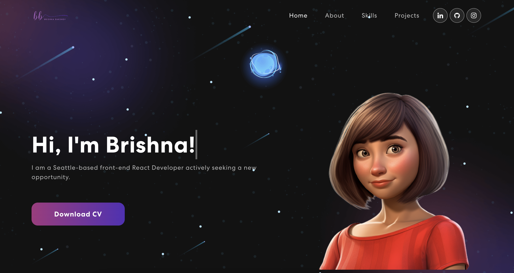

# Personal Portfolio

#### By: Brishna Bakshev

#### Description: A personal portfolio website that will include my projects, resume, and a contact form.

### Live Link
`https://brishna-bakshev.vercel.app/`

## Technologies Used

* _React_
* _JSX_
* _HTML/CSS_
* _JavaScript_
* _Node_

## Setup/Installation Requirements

* First, copy the git repository url and open a shell program & navigate to your machine's desktop
* Clone the repository using the copied URL and the `git clone` command
* In the shell program, navigate to the root directory of the newly created file called "PersonalPorfolio"
* Run the `npm install` command to install dependencies
* After the installation updates, in the root directory type `npm run start` to start the program
* If the web page doesn't open on its own, open a web browser (such as Google Chrome) and enter the following into the URL: `http://localhost:3000/`

### Research and Planning Log

##### Saturday, 4/29

- 10:00am - 11:00am: Brainstorming and research on what to do for the project and what technologies to use.
- 11:00am - 12:00pm: Research on how to use the technologies I have chosen to use for the project. The technologies I will be using are React, Javascript, and Firebase
- 12:00pm - 2:00pm: Research on how to use React and Firebase together. I found a tutorial on how to use React and Firebase together and I will be using that as a guide for my project. As well as reading the weekend homework to get a better understanding of how to use React and Firebase together.
- 2:00pm - 3:00pm: Researching how the website is going to look and what features I want to include in the website.

##### Sunday, 4/30
- 12:00am - 1:00pm: Watching different tutorial videos on youtube to get a better understanding of how to use React and Firebase together.
- 1:00pm - 2:00pm: Researching on what other 'eye catching' React libraries are available to use for my project.
- 2:00pm - 3:00pm: Researching on how to use the React libraries I have chosen to use for my project.

##### Friday, 5/5
- 8:15am - 10:00am: Watching tutorial videos on how to create a portfolio site using React. The tutorial I am using is: https://youtu.be/0fYi8SGA20k

## Available Scripts

In the project directory, you can run:

### `npm start`

Runs the app in the development mode.
Open [http://localhost:3000](http://localhost:3000) to view it in your browser.

The page will reload when you make changes.
You may also see any lint errors in the console.

### `npm run build`

Builds the app for production to the `build` folder.
It correctly bundles React in production mode and optimizes the build for the best performance.

The build is minified and the filenames include the hashes.
Your app is ready to be deployed!

See the section about [deployment](https://facebook.github.io/create-react-app/docs/deployment) for more information.

### `npm run eject`

**Note: this is a one-way operation. Once you `eject`, you can't go back!**

If you aren't satisfied with the build tool and configuration choices, you can `eject` at any time. This command will remove the single build dependency from your project.

Instead, it will copy all the configuration files and the transitive dependencies (webpack, Babel, ESLint, etc) right into your project so you have full control over them. All of the commands except `eject` will still work, but they will point to the copied scripts so you can tweak them. At this point you're on your own.

You don't have to ever use `eject`. The curated feature set is suitable for small and middle deployments, and you shouldn't feel obligated to use this feature. However we understand that this tool wouldn't be useful if you couldn't customize it when you are ready for it.

## Known Bugs

N/A

## License

_[MIT](https://opensource.org/license/mit/)_

Copyright (c) 2023 _Brishna Bakshev_